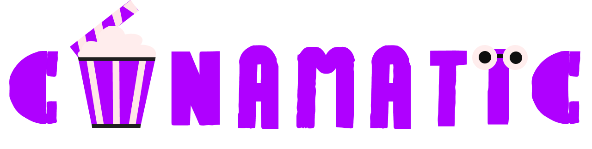

## Social AI-powered movie tracker & reviews 
[🔴 Click Here](https://12angrymen.vercel.app)

 ## Introduction 🗿
***
Developed with Next.js and integrating advanced AI features, Cinematic is a social platform for film enthusiasts. Users can search for movies, rate and review them, and track their viewing history. The app offers a personalized watchlist, allows users to follow friends, and share their cinematic experiences. With AI-powered recommendations, Cinematic enhances movie discovery, making it a comprehensive tool for movie lovers.

***
## Tech Stack

- **Frontend:**
  - Next.js
  - Tailwind CSS
  - Socket.IO
  - Zustand

- **Backend:**
  - Node.js
  - Express.js
  - MongoDB
  - Mongoose
  - JWT (JSON Web Tokens)
  - Bcrypt.js
  - Socket.IO
  - Redis

# 

Cinematic is a comprehensive platform designed for film enthusiasts to enhance their movie-watching experience.

## 🔥 Features

- **🏠 Responsive Home Page:** A visually appealing display of popular films, providing users with a captivating introduction to a diverse range of movies with Authentication system.

 - **🛹 Data Managing and Caching :** Manage the bulk of movie,user data are managed by MongoDB and Caching for fast retrival via Redis.

- **🔍 Movie Exploration and Filtering:** Explore a wide variety of films from around the world, utilizing a search system to search your fav movie ot movie to get track.

- **⭐ Rating and Reviewing:** Rate and review films, sharing your opinions and insights with the community.

- **📓 Journal:** Keep a diary of your film-watching experiences, allowing you to document your thoughts and reflections on each movie via watched and like .

- **👥 Social Features:** Follow friends and share your watching experience, fostering a community of film lovers chat with your fellow cinephiles.

- **🤖 AI-Powered Recommendations:** Receive personalized movie suggestions based on your preferences and prompts.

These features collectively provide a rich and engaging environment for users to discover, track, and share their cinematic journeys.

# 🎬 Cinematic

Cinematic is a comprehensive platform designed for film enthusiasts to enhance their movie-watching experience.

## 🚀 Getting Started

To begin using Cinematic, follow these steps:

1. **Registration:**
   - Navigate to the [Cinematic website](https://12angrymen.vercel.app).
   - Click on the **Register** button.
   - Provide a valid email address and create a secure password.
   - Your password will be securely encrypted before storage.

2. **Login:**
   - After registration, proceed to the **Login** page.
   - Enter your registered email and password to access your account.

## 🛠️ Behind the Scenes

- **Data Storage:**
  - **MongoDB:** All user information, including profiles, movie ratings, reviews, and watched, is stored in MongoDB, ensuring data persistence and reliability.
  - **Redis:** To enhance performance, frequently accessed data is cached in Redis, reducing database load and speeding up data retrieval.

- **State Management:**
  - **Zustand with Persistence:** The application uses Zustand for state management, with persistence enabled to maintain user information and preferences across sessions.

- **Authentication:**
  - **JWT Tokens:** Upon successful login, a JSON Web Token (JWT) is generated to authenticate user sessions securely.

## 🎥 Exploring Cinematic

Once logged in, you can:

- **Home Page:**
  - Discover trending movies showcased prominently.

- **Search and Filter:**
  - Utilize the search bar to find your favorite movies.
  

- **Profile Management:**
  - Update your bio and profile picture to personalize your account.

- **Movie Interaction:**
  - Mark movies as watched and add them to your favorites.
  - Rate and review movies to share your opinions with the community.

- **AI Features:**
  - Leverage AI-powered recommendations to discover movies tailored to your preferences.

- **Social Interaction:**
  - Search for friends within the platform.
  - Engage in real-time chat conversations to discuss your favorite films.

## 🖥️ Technical Overview

- **Data Flow:**
  - User actions trigger API calls to the backend server.
  - The server processes requests, interacts with MongoDB for data storage, and utilizes Redis for caching.

- **Caching Mechanism:**
  - Redis stores frequently accessed data, reducing latency and improving response times.

- **State Persistence:**
  - Zustand ensures that user preferences and session data are maintained, even after refreshing the browser or logging back in.

- **Security:**
  - Passwords are hashed using bcrypt before storage, ensuring they are not stored in plain text.
  - JWT tokens are used to verify user identity during interactions with the platform.
 
  - **Multer & Gemini:**
  - Multer handles profile picture uploads and validation.
  - Gemini AI, integrated via Google AI Studio, powers AI-driven features.

By following this guide, you'll be well-equipped to navigate and utilize all the features Cinematic offers, while understanding the technical processes that ensure a seamless and secure user experience.

## 🎭 Made with ❤️ by Sounabh 

- Thank you for checking out Cinematic! Enjoy discovering and sharing amazing films. 🎥

